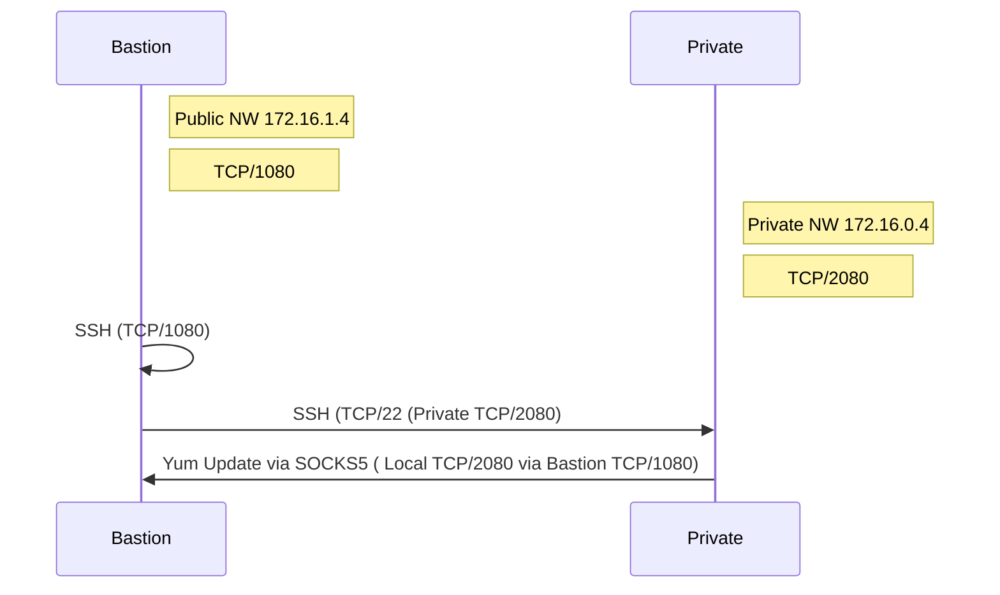

# How to yum update from private network

In this example, SSH dynamic forwarding is used to execute yum update via a stepping-stone server.

## Environment
Note: SSH Server do not need to configure.

- Bastion  
this server can access to internet.

- Private  
this server can't connect internet.  



## Configure security group

|         |          Inbound           |          Outbound          |
| :-----: | :------------------------: | :------------------------: |
| Bastion |             -              | TCP/22 DEST 172.16.0.0./16 |
| Private | TCP/22 DEST 172.16.0.0./16 |             -              |


## Try yum update

1. Bastion

`$ ssh -i KEY_FILE USER:BASTION_IP_ADDRESS -D BASTION_PORT`  

`$ ssh -i /home/ec2-user/.ssh/web.pem ec2-user@172.16.1.4 -D 1080`

2. Private

`$ ssh -i KEY_FILE -R PRIBATE_PORT:localhost:BASTION_PORT USER@PRIVATE_IP_ADDRESS`  

`$ ssh -i .ssh/web.pem -R 2080:localhost:1080 centos@172.16.0.4`

3. configure yum.conf

`$ sudo vi /etc/yum.conf`

```bash
proxy=socks5://127.0.0.1:2080
```

4. yum update

`$ sudo yum update`
